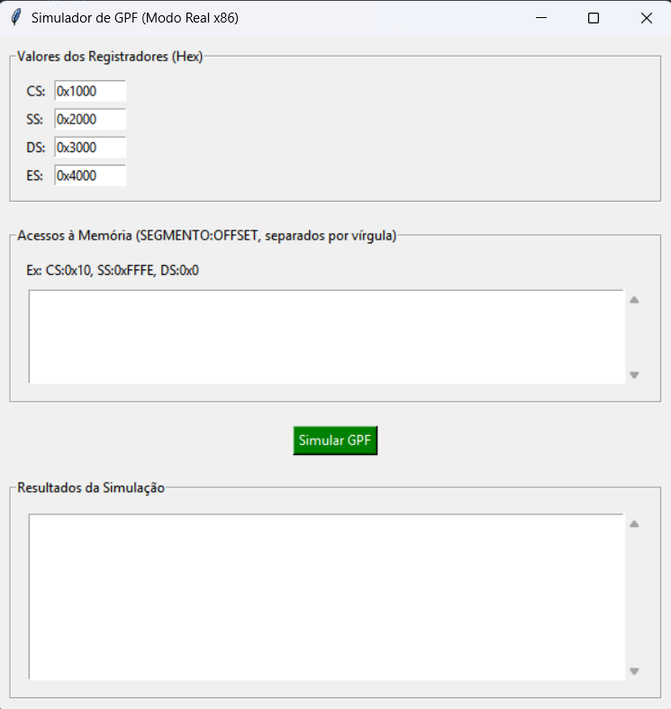
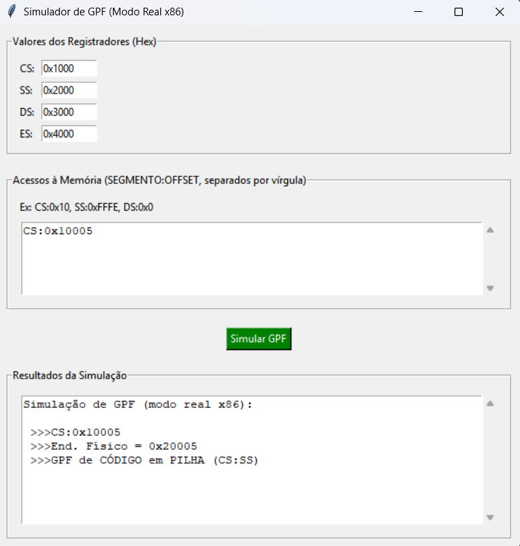

# Simulador de GPF em Modo Real - Processadores x86

## O que é

Esse projeto é um trabalho prático da Universidade Federal da Bahia (UFBA) para a matéria Arquitetura de Computadores, em que ele tem como objetivo expor os conhecimentos aprendidos sobre GPF em Modo Real e simular situações diferentes que o Usuário decide os registradores e onde seram tentados os acessos à ele.

Com base nas entradas o simulador responde se houve GPF, como e onde foi o GPF ou se é possível acessar tranquilamente aquela parte da memória com base no OFFSET.

## Resumo

- A linguagem escolhida foi python por sua praticidade e fácil entendimento.
- Há 4 funções no código, duas responsáveis pelo funcionamento e cálculo dos endereços físicos e comparando se dá ou não GPF, e outras duas responsáveis pela interface e pelo botão "Simular GPF"
- O código utiliza de tkinter para desenvolvimento de uma interface simples, ele roda via desktop

## Como funciona

**Interface Simples:** Através do tkinter, permite uma interação fácil e intuitiva
**Definição dos Segmentos:** O usuário pode definir os endereços base em hexadecimal para os registradores de segmento do Modo Real: CS, SS, DS e ES
**Acessos à memória:** O usuário manda na entrada uma lista de acessos no formato `SEGMENTO:OFFSET`
**Cálculo de Endereço Físico:** O código calcula e exibe o endereço físico para cada acesso.
**Detecção de GPF:** Com base nos endereços base dos registradores e no endereço físico, mostre se:
    - Ocorre uma invasão de segmento (por exemplo, um acesso de `CS` que cai em `DS`)
    - O offset ultrapassa o limite de 64KB do segmento (`0xFFFF`)
**Resultados:** Para cada tentativa de acesso escrita, há o output do endereço físico e se ocorreu ou não o GPF

## Pré-requisitos

**Python 3:** O código foi desenvolvido em Python 3. A biblioteca `tkinter` já vem instalada com o Python

### Exemplo de Simulação

Utilizando valores padrão da interface:
- `CS = 0x1000` (Intervalo físico: `0x10000` a `0x1FFFF`)
- `SS = 0x2000` (Intervalo físico: `0x20000` a `0x2FFFF`)

Tentando o acesso à `CS:0x10005`:

1.  **Cálculo do Endereço Físico:**
    1.1 `Endereço = (0x1000 * 10) + 0x10005`
    1.2 `Endereço = 0x10000 + 0x10005 = 0x20005`
2.  **Análise:**
    2.1 O endereço físico `0x20005` adentra no segmento de pilha `SS` (`0x20000` a `0x2FFFF`), porém foi tentado o acesso em dados (CS)
3.  **Resultado:** O programa indicará uma **GPF de CÓDIGO em PILHA (CS:SS)**, pois um acesso que deveria estar no segmento de código invadiu o segmento de pilha

## 👥 Autores e Créditos

Este projeto foi desenvolvido em equipe, eis as funções:

- **Gustavo Silva dos Santos:** Responsável pela interface gráfica
- **Pedro Henrique Dias Simão:** Responsável pela lógica do programa
- **Lucas Pereira Rapozo:** Responsável pela revisão e teste do programa
- **Felipe Sant'ana:** Responsável por revisão do código e ajuda na interface

## 📄 Licença

Este projeto é de código aberto